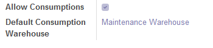
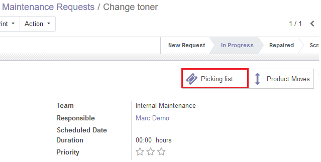
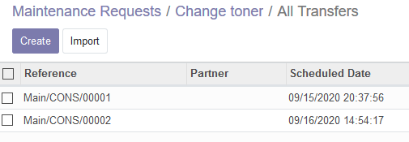
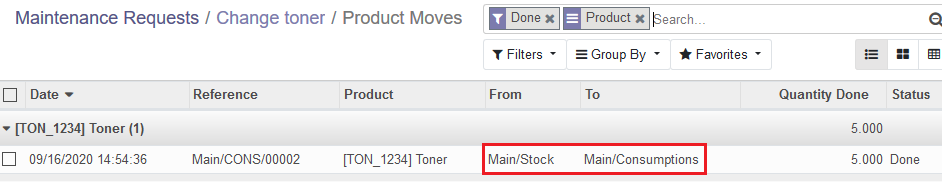
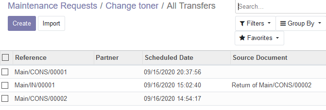

Once installed, first you should enable consumptions for a certain equipment
and filling a default warehouse for the picking operations:

Then, for every mainteance request of this equipment, *Picking List* button
allows us to make consumptions, that will be picking documents with their own 
sequence:

By default, the origin location for this operations will be the stock location
for the default warehouse, and destination a new *Consumptions* location, that
will not compute for stock inventory, like e.g. partner locations:

From both request and equipment forms these stock operations and *Product Moves*
are available.

Return operations are also enabled, and will be linked to the request and 
equipment as well:

